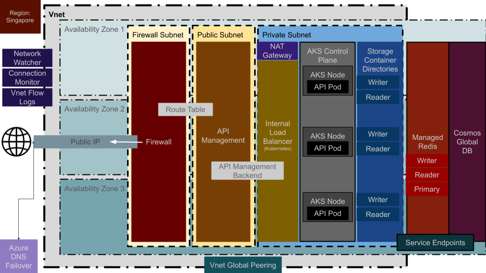
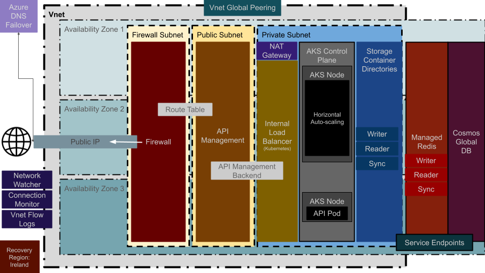

# Stratosphere

## Diagram

> Example of an AWS Based High Availability and Multi-Region Recovery (Pilot Light) Diagram


---

> Example of an AZURE Based High Availability and Multi-Region Recovery (Pilot Light) Diagram





---

## CI/CD

> GitHub: [github-actions.yml](.github/workflows/github-actions.yml)

> GitLab: [.gitlab-ci.yml](.gitlab-ci.yml)

> Azure DevOps: [azure-pipelines.yml](azure-pipelines.yml)

> Bitbucket: [bitbucket-pipelines.yml](bitbucket-pipelines.yml)

---

## GitOps

### AWS

> EKS Argo-CD Cluster Deployment: [argo-cd.tf](infrastructure-aws/argo-cd/argo-cd.tf)

> EKS Argo-CD Sample Application Spec: [argo-cd-sample-application-spec.yaml](infrastructure-aws/argo-cd/argo-cd-sample-application-spec.yaml)

### AZURE

> AKS Argo-CD Cluster Deployment: [argo-cd.tf](infrastructure-azure/argo-cd/argo-cd.tf)

> AKS Argo-CD Sample Application Spec: [argo-cd-sample-application-spec.yaml](infrastructure-azure/argo-cd/argo-cd-sample-application-spec.yaml)

### GCP

> GKE Argo-CD Cluster Deployment: [argo-cd.tf](infrastructure-gcp/argo-cd/argo-cd.tf)

> GKE Argo-CD Sample Application Spec: [argo-cd-sample-application-spec.yaml](infrastructure-gcp/argo-cd/argo-cd-sample-application-spec.yaml)

---

## DevSecOps

> Jenkins Container: [compose.yaml](compose.yaml) / [jenkins.Dockerfile](jenkins.Dockerfile)

> Jenkins Pipeline with Vulnerability Scanner, SBOM and SAST: [Jenkinsfile](Jenkinsfile)

> Docker Local Vulnerability Scanner, SBOM and SAST Container: [compose.yaml](compose.yaml) / [vulnerabilities.Dockerfile](vulnerabilities.Dockerfile)

- Vulnerability Scanner: [Trivy](https://github.com/aquasecurity/trivy)

- SBOM: [Syft](https://github.com/anchore/syft) / [Grype](https://github.com/anchore/grype)

- SAST: [Semgrep](https://github.com/semgrep/semgrep)

---

## IaC Components

> Note: Each component is built in a non-modular way to show the full implementation and to allow to independently create, update or delete them

## AWS

1. [VPC](infrastructure-aws/vpc/main.tf)
2. [VPC Flow Logs](infrastructure-aws/security/vpc-flow-logs/main.tf)
3. [Cloud Trail](infrastructure-aws/security/cloud-trail/main.tf)
4. [Network Load Balancers](infrastructure-aws/load-balancer/main.tf)
5. [Shield](infrastructure-aws/security/shield/main.tf)
6. [API Gateway](infrastructure-aws/api-gateway/http/main.tf)
7. [Databases](infrastructure-aws/databases/aurora/main.tf)
8. [Cache](infrastructure-aws/databases/elasticache/main.tf)
9. [EFS](infrastructure-aws/storage/efs/main.tf)
10. [S3](infrastructure-aws/storage/s3/main.tf)
11. [EKS Cluster](infrastructure-aws/eks/main.tf)
12. [EKS Cluster IAM Permissions](infrastructure-aws/eks/permissions.tf)
13. [Kubernetes Namespaces](infrastructure-aws/workloads/devops/namespaces/main.tf)
14. [Kubernetes Secrets](infrastructure-aws/workloads/devops/secrets/main.tf)
15. [Helm Charts](infrastructure-aws/workloads/devops/charts/)
16. [CI/CD - Build Agents](infrastructure-aws/workloads/devops/build-agents/main.tf)
17. [Workload - Sample Game 2048 App](infrastructure-aws/workloads/applications/game-2048/main.tf)
18. [Rancher Instance](infrastructure-aws/rancher/main.tf)
19. [EKS Argo-CD](infrastructure-aws/argo-cd/argo-cd.tf)


## AZURE

1. [VNET](infrastructure-azure/vnet/main.tf)
2. [VNET Flow Logs](infrastructure-azure/security/vnet-flow-logs/main.tf)
3. [Firewall](infrastructure-azure/security/firewall/main.tf)
4. [API Management](infrastructure-azure/api-management/main.tf)
5. [Databases](infrastructure-azure/databases/cosmos/main.tf)
6. [Cache](infrastructure-azure/databases/cache/main.tf)
7. [Storage Container](infrastructure-azure/storage/container/main.tf)
8. [AKS Cluster](infrastructure-azure/aks/main.tf)
9. [Workload - Sample Game 2048 Chart](infrastructure-azure/workloads/devops/charts/game-2048/)
10. [Rancher Instance](infrastructure-azure/rancher/main.tf)
11. [AKS Argo-CD](infrastructure-azure/argo-cd/argo-cd.tf)


## GCP

1. [VPC](infrastructure-gcp/vpc/main.tf)
2. [GKE Cluster](infrastructure-gcp/gke/main.tf)
3. [Workload - Sample Game 2048 Chart](infrastructure-gcp/workloads/devops/charts/game-2048/)
4. [Rancher Instance](infrastructure-gcp/rancher/main.tf)
5. [GKE Argo-CD](infrastructure-gcp/argo-cd/argo-cd.tf)

---

## IaC Tooling

### AWS

> Packer Golden AMI: [packer/rancher-ubuntu-aws.pkr.hcl](packer/rancher-ubuntu-aws.pkr.hcl)

### AZURE

> Packer Golden VM: [packer/rancher-ubuntu-azure.pkr.hcl](packer/rancher-ubuntu-azure.pkr.hcl)

### GCP

> Packer Golden Image: [packer/rancher-ubuntu-gcp.pkr.hcl](packer/rancher-ubuntu-gcp.pkr.hcl)

---

## IaC Config Tooling

> Ansible Inventory: [ansible/inventory/docker_hosts.ini](ansible/inventory/docker_hosts.ini)

> Ansible Vulnerabilities Playbook: [ansible/playbooks/vulnerabilities_local_scan.yaml](ansible/playbooks/vulnerabilities_local_scan.yaml)

> Ansible Host Dockerfile: [vulnerabilities.Dockerfile](vulnerabilities.Dockerfile)

> Ansible Python3.12+ Requirements: [ansible/ansible-requirements.txt](ansible/ansible-requirements.txt)

```bash
python3 -m venv ./ansible/.venv-ansible

source ./ansible/.venv-ansible/bin/activate

python3 -m pip install -r ./ansible/ansible-requirements.txt

ansible-inventory -i ./ansible/inventory/docker_hosts.ini --list

ansible-playbook -i ./ansible/inventory/docker_hosts.ini ./ansible/playbooks/vulnerabilities_local_scan.yaml

deactivate

rm -rf ./ansible/.venv-ansible
```
