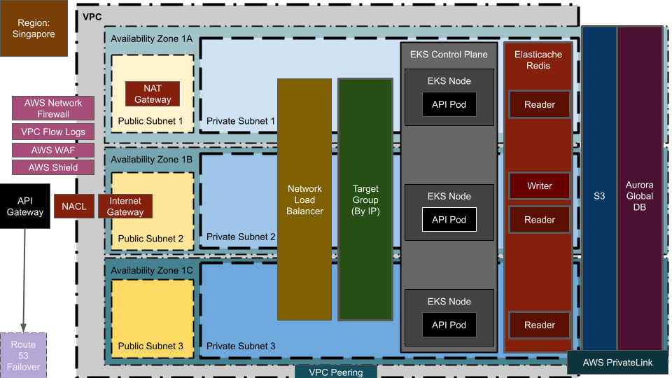
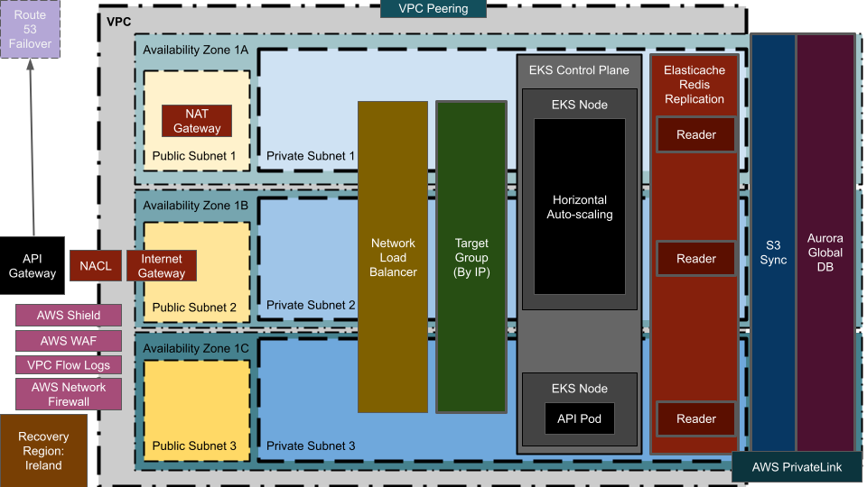

# Stratosphere

## Diagram

> Example of an AWS Based High Availability and Multi-Region Recovery (Pilot Light) Diagram

## CI/CD

> GitHub: [github-actions.yml](.github/workflows/github-actions.yml)

> GitLab: [gitlab-ci.yml](.gitlab-ci.yml)

> Azure DevOps: [azure-pipelines.yml](azure-pipelines.yml)

> Bitbucket: [bitbucket-pipelines.yml](bitbucket-pipelines.yml)

## DevSecOps

> Jenkins Container: [compose.yaml](compose.yaml)

> Jenkins Pipeline with Vulnerability Scanner, SBOM and SAST: [Jenkinsfile](Jenkinsfile)

- Vulnerability Scanner: [Trivy](https://github.com/aquasecurity/trivy)

- SBOM: [Syft](https://github.com/anchore/syft) / [Grype](https://github.com/anchore/grype)

- SAST: [Semgrep](https://github.com/semgrep/semgrep)

## Components

> Note: Each component is built in a non-modular way to show the full implementation and to allow to independently create, update or delete them

1. [VPC](infrastructure/vpc/main.tf)
2. [VPC Flow Logs](infrastructure/security/vpc-flow-logs/main.tf)
3. [Cloud Trail](infrastructure/security/cloud-trail/main.tf)
4. [Network Load Balancers](infrastructure/load-balancer/main.tf)
5. [Shield](infrastructure/security/shield/main.tf)
6. [API Gateway](infrastructure/api-gateway/http/main.tf)
7. [Databases](infrastructure/databases/aurora/main.tf)
8. [Cache](infrastructure/databases/elasticache/main.tf)
9. [EKS Cluster](infrastructure/eks/main.tf)
10. [EKS Cluster IAM Permissions](infrastructure/eks/permissions.tf)
11. [Kubernetes Namespaces](infrastructure/workloads/devops/namespaces/main.tf)
12. [Kubernetes Secrets](infrastructure/workloads/devops/secrets/main.tf)
13. [Helm Charts](infrastructure/workloads/devops/charts/)
14. [CI/CD - Build Agents](infrastructure/workloads/devops/build-agents/main.tf)
15. [Workload - Sample Game 2048 App](infrastructure/workloads/applications/game-2048/main.tf)
