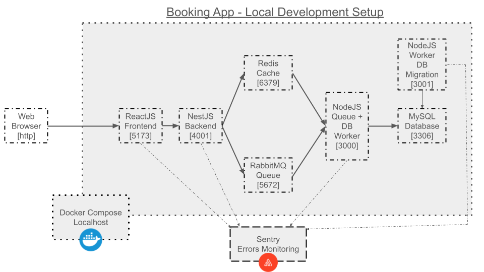

# Booking App


## Diagram




## Diagram Flow

PDF version [here](diagram/Diagram-Flow.pdf)

|  |  | Web Client / Browser \[http\] |  |  |
| ----- | ----- | ----- | ----- | ----- |
|  |  |  |  |  |
|  | ReactJS Frontend |  |  |  |
|  | ↙ |  | ↘ |  |
| User not logged in |  |  | User is logged in |  |
| ↓ |  | ↙ |  |  ↘ |
| 1\. User creates booking |  | 1\. User creates account | ↗ | 16\. User creates booking |
| 2\. ReactJS sends the booking data to NestJS via endpoint |  | 2\. ReactJS sends the account data to NestJS via endpoint | ↗ | 17\. ReactJS sends the booking data to NestJS via endpoint |
| ↓ |  | ↓ | ↑ | ↓ |
| NestJS Backend |  | NestJS Backend | ↑ | NestJS Backend |
| 3\. Backend generates booking confirmation  |  | 3\. Backend saves account data into MySQL DB  | ↑ | 18\. Backend generates booking confirmation  |
| 4\. Booking confirmation is saved in Redis cache |  | 4\. NestJS issues a JWT token for the user (24 hours validity)  | ↑ | 19\. Booking confirmation is saved in Redis cache |
| 5\. Booking ID is sent to RabbitMq queue  |  | 5\. NestJS sends back confirmation with JWT token to ReactJS via endpoint | ↑ | 20\. Booking ID is sent to RabbitMq queue  |
| 6\. NestJS sends back confirmation to ReactJS via end endpoint |  | ↓ | ↑ | 21\. NestJS sends back confirmation to ReactJS via end endpoint |
| ↓ |  | ReactJS Frontend | ↑ | ↓ |
| ReactJS Frontend |  | 6\. Frontend receives JWT token from Backend and saves it to ‘React State’ | ↑ | ReactJS Frontend |
| 7\. User can modify booking or print as PDF from the browser |  | 7\. ReactJS gets web client IP address and saves it to ‘React State’  | ↑ | 22\. User can modify booking or print as PDF from the browser |
| ↓ |  | 8\. Frontend sends to Backend via endpoint an object with JWT token, user login data (without password) and web client IP | ↑ | ↓ |
| NodeJS Worker |  | ↓ | ↑ | NodeJS Worker |
| 8\. NodeJS worker running polling the RabbitMq queue receives the booking ID  |  | NestJS Backend |  | 23\. NodeJS worker running polling the RabbitMq queue receives the booking ID  |
| 9\. The worker fetches the booking confirmation from the ID into Redis cache  |  | 9\. NestJS saves JWT token, user login data (without password) web client IP and user to Redis cache | ↑ | 24\. The worker fetches the booking confirmation from the ID into Redis cache  |
| 10\. The worker does an INSERT into the MYSQL DB (User will not see the data inserted in the DB since there is no login) |  | 10\. Backend sends confirmation to Frontend | ↑ | 25\. The worker does an INSERT into the MySQL DB (User will not see the data inserted in the DB since there is no login) |
| 11\. If user creates an account later with the same email address as the bookings, the saved data will be linked to user profile |  | ↓ | ↑ | ↓ |
|  |  | ReactJS Frontend | ↑ | NestJS Backend |
|  |  | 11\. User can now update profile, reset password or logout (Logout will clear cached data) | ↑ | 26\. Backend in sync and reading from the MySQL DB table with bookings |
|  |  | 12\. On page refresh, ReactJS fetches the cached JWT token using the web client IP and logs in the user | ↑ | 27\. Endpoint available for ReactJS to call the saved data |
|  |  | 13\. Login valid for 24 hours | ↑ | ↓ |
|  |  | 14\. JWT token will expire after 24 hours | ↑ | ReactJS Frontend |
|  |  | 15\. Login cached data will be auto-deleted after 24 hours from Redis | ⤴ | 28\. User can now view all bookings made |


## Required
create `.env`
```
MYSQL_ROOT_PASSWORD="booking"
MYSQL_DATABASE="booking"
MYSQL_USER="booking"
MYSQL_PASSWORD="booking"

RABBITMQ_DEFAULT_USER="guest"
RABBITMQ_DEFAULT_PASS="guest"

REDIS_HOST="redis"

ENVIRONMENT="dev"
REACT_BACKEND_URL="http://localhost:4001"

SENTRY_DNS_NODE=""
SENTRY_DNS_NEST=""
SENTRY_DNS_REACT=""

```

create `nestjs/.env`
```bash
ENV="dev"
SENTRY_DNS=""
JWT_SECRET="some-secret"
JWT_EXPIRATION_TIME="1d"
REDIS_HOST="redis"
```

create `nestjs/src/configs/jwt-secret.ts`
```bash
export const JWT_SECRET = "some-secret";
```

change Redis host to `localhost` in `nestjs/src/booking/booking.service.ts` (leave host `redis` if running with Docker Compose)
```
      const client = createClient({
        socket: {
          // host: 'redis',
          host: 'localhost',
          port: 6379,
        },
```

change MySql host to `localhost` in `nestjs/src/app.module.ts` (leave host `mysql` if running with Docker Compose) and set the password as follows:
```
    TypeOrmModule.forRoot({
      type: 'mysql',
      host: 'localhost',
      // host: 'mysql',
      port: 3306,
      username: 'booking',
      password: 'booking',
      database: 'booking',
      entities: [Users, Booking],
      synchronize: true,
    }),
```

see https://sentry.io/pricing/ for a Sentry free-trial account to gain access to the monitor dashboard

## Execution
`docker compose up --build --no-deps --force-recreate --remove-orphans`
